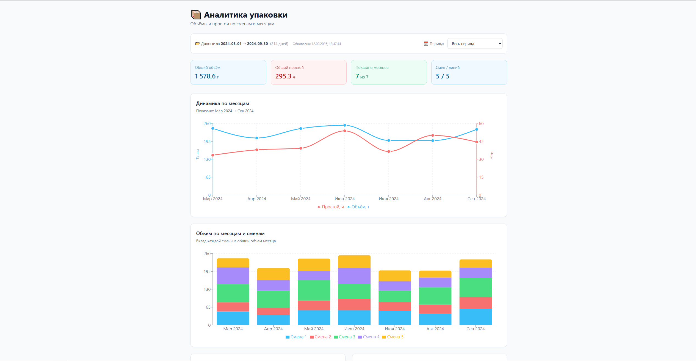

# 📦 Packaging Analysis

Аналитический дашборд для производственной отчётности упаковочного цеха.



---

## 🎯 О проекте

Полный цикл анализа: от «грязного» Excel-отчёта до интерактивного дашборда.

- **Backend (Python + pandas)** — парсит Excel, чистит данные, считает метрики, отдаёт JSON
- **Frontend (React + Recharts)** — визуализирует: KPI-карточки, графики по сменам и месяцам

**Публичная версия** работает на **синтетических данных** (2024 год).
Реальный проект используется в закрытом контуре компании.

---

## 🚀 Быстрый старт

### 1. Клонировать и установить

```bash
git clone https://github.com/Anatoliy-Shi/packaging-analysis.git
cd packaging-analysis
```

### 2. Backend — генерация данных

```bash
cd backend
python -m venv .venv
source .venv/bin/activate        # Windows: .venv\Scripts\activate
pip install -e ".[dev]"
python scripts/make_demo_data.py
```

### 3. Frontend — запуск дашборда

```bash
cd ../frontend
npm install
npm run dev
```

Открой `http://localhost:5173`.

---

## 📊 Что умеет

| Функция | Реализация |
|---------|-----------|
| Парсинг «грязного» Excel | pandas + openpyxl, авто-поиск шапки |
| Очистка данных | обработка пропусков, три формата времени, объединённые ячейки |
| Агрегация | по сменам, по месяцам, «месяц × смена» |
| Визуализация | Recharts: bar, stacked bar, line, composed |
| Фильтр по периоду | пресеты + кастомный диапазон |
| Экспорт | CSV (для BI) + JSON (для фронта) |
| Адаптив | работает на телефоне |

---

## 🛠 Стек

**Backend:**
- Python 3.10+
- pandas, openpyxl

**Frontend:**
- React 18 + Vite
- Recharts
- TailwindCSS

**Инфраструктура:**
- Git, GitHub Pages

---

## 🏗 Архитектура

```
Excel (.xlsm)
    │
    ▼  backend/loader.py
DataFrame (очищенный)
    │
    ▼  backend/analytics.py
Метрики (объём, простой, по месяцам)
    │
    ▼  backend/exporters.py
analytics.json  +  *.csv
    │
    ▼  frontend/useAnalytics.js
React-дашборд (Recharts)
```

---

## 📂 Структура проекта

```
packaging-analysis/
├── backend/                    # Python
│   ├── config.py               # настройки, пути, колонки
│   ├── loader.py               # Excel → DataFrame
│   ├── analytics.py            # DataFrame → метрики
│   ├── exporters.py            # метрики → CSV + JSON
│   ├── main.py                 # оркестрация
│   └── scripts/
│       └── make_demo_data.py   # генератор синтетики
│
├── frontend/                   # React
│   ├── src/
│   │   ├── components/
│   │   ├── charts/
│   │   └── hooks/
│   └── public/data/
│       └── analytics.json      # синтетические данные
│
├── docs/                       # скриншоты
│   └── dashboard.png
│
├── README.md
├── LICENSE
└── .gitignore
```

---

## 🔒 Конфиденциальность

Проект работает с реальными производственными данными, которые
не могут быть опубликованы.

В публичном репозитории — **синтетическая версия**:

- Данные за **2024 год** (не реальный период)
- **5 смен** и **5 линий** (не реальные)
- Объём и простои **выдуманы**
- В JSON стоит флаг `_demo: true`

Относительные соотношения (какая смена эффективнее) **сохранены** —
чтобы дашборд показывал осмысленные тренды.

**Переключается одним скриптом:**

```bash
python backend/scripts/make_demo_data.py    # синтетика для публики
```

---

## 📄 Лицензия

MIT — см. [LICENSE](LICENSE)

---

## 👤 Автор

**Анатолий Ши**
- GitHub: [@Anatoliy-Shi](https://github.com/Anatoliy-Shi)